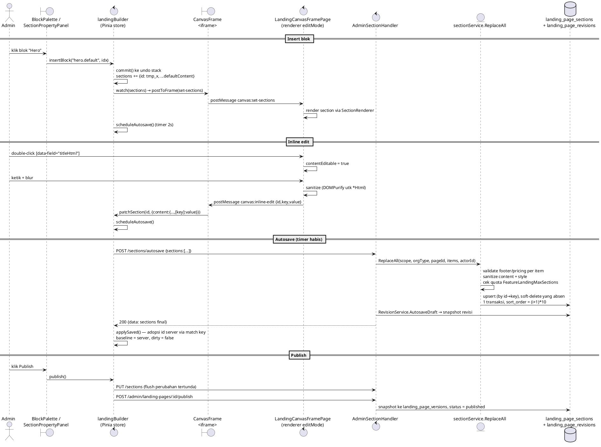

# Landing Page Visual Builder

Editor konten landing page berbentuk **visual WYSIWYG canvas** yang menggantikan
schema-driven form builder lama (`LandingContentManagementPage.vue`, dihapus).
Route menu tetap sama: `/app/landing-pages/content` (nama route `*-content`).

Source of truth kontrak HTTP tetap `api/openapi.yaml`. Dokumen ini menjelaskan
arsitektur dan hal-hal yang tidak terlihat dari OpenAPI saja.

> **Catatan pivot (10 Sep 2026):** builder section berbasis komponen Vue di
> bawah ini **dibekukan** untuk page lama. Page baru memakai **GrapesJS** —
> lihat bagian **8. GrapesJS builder** di akhir dokumen. Kedua builder hidup
> berdampingan lewat kolom `landing_pages.builder` (`'sections'` | `'grapesjs'`).

---

## 1. Arsitektur

```
┌─ LegacySectionBuilderPage.vue (3 pane, FROZEN) ────────────────────────────┐
│  ┌ BlockPalette ┐  ┌ CanvasFrame ── <iframe> ─┐  ┌ SectionPropertyPanel ┐  │
│  │ katalog blok │  │  src=/landing-canvas/:id  │  │  Content / Appearance │  │
│  │ (akordeon    │  │  ↕ postMessage (bridge)   │  │  / Spacing / Advanced │  │
│  │  per grup)   │  │  drag palette → drop di   │  │  (akordeon)           │  │
│  └──────────────┘  │  antara section (pointer) │  └──────────────────────┘  │
│                    └──────────────────────────┘                            │
│         Pinia store: stores/landingBuilder.ts                              │
│         sections[] · selectedId · dirty · history(undo/redo) · autosave    │
└───────────────────────────────────────────────────────────────────────────┘
        │ POST /admin/landing-pages/:id/sections/autosave   (debounce 2s)
        │ PUT  /admin/landing-pages/:id/sections            (Save / Publish)
        ▼
   modul landing (Go) — sanitize content+style, quota, 1 transaksi
```

- **Iframe canvas** (`LandingCanvasFramePage.vue`, route `landing-canvas`): halaman
  SPA tanpa app shell yang me-render `LandingPageRenderer` dengan `editMode`. Section
  komponen renderer yang sama seperti produksi, tapi side-effect dinetralkan
  (`useEditMode` → `provideEditMode`): PricingSection tidak fetch katalog publik,
  FooterNewsletter tidak submit, ThreeJSHero jadi poster statis, HeroSection tidak
  memasang listener parallax, semua `.fade-up` dipaksa terlihat.
- **Bridge** (`shared/canvas/bridge.ts`): protokol `postMessage` bertipe, semua
  pesan divalidasi terhadap `window.location.origin` dan berprefiks `canvas:`.
  Payload di-`JSON` round-trip (`toPlain`) sebelum dikirim — `postMessage`
  structured clone tidak bisa meng-clone Vue reactive proxy (`sections` dari
  store).
  - parent → iframe: `set-sections`, `set-selected`, `set-device`
  - iframe → parent: `ready`, `select`, `reorder`, `request-insert`,
    `request-delete`, `inline-edit`, `size`
- **Drag palette → canvas** (`CanvasFrame.startBlockDrag`): HTML5 DnD tidak
  menyeberang batas iframe dengan andal, jadi drag dari palette bersifat
  pointer-driven dan di-host di `CanvasFrame` (parent). Saat drag aktif,
  `iframe.style.pointerEvents = 'none'` supaya parent tetap menerima
  `pointermove`/`pointerup` di atas iframe; posisi sisip dihitung dengan membaca
  `iframe.contentDocument.querySelectorAll('[data-section-id]')` langsung
  (same-origin), lalu `store.insertBlock(blockId, index)`. Tidak ada panel
  "Struktur halaman" lagi — select/hapus/reorder semua dari kanvas.
- **Header = section `header` per-page** (migration `000089` menambah `header` ke
  CHECK `landing_page_sections_type_check` + `landing_section_templates_type_check`;
  `domain.SectionTypeHeader`). `pageService.Create` men-seed 1 section `header` di
  `sort_order 0` untuk page non-template (lewat repo → tak kena quota). Dirender
  `HeaderSection.vue` (`sticky top-0`), pola sama footer: kontennya
  di-`content-override` dengan hasil synthesize — item link dari menu tenant
  `landing_menus` location=header, logo/nama dari branding
  (`LandingPageRenderer.contentOverrideFor`). Page yang section `header`-nya
  dihapus = tanpa menu. `MarketingLayout.vue` menyembunyikan `<nav>` bila page
  punya section `header` (event `landing-header-mode`).
- **Panel Header di builder**: `HeaderSectionPanel.vue` (dipilih saat
  `selectedSection.type === 'header'`, judul aside `"Header"`) — `<details>`
  collapsible per klasifikasi (tanpa box border), 4 area:
  - **Brand & Logo** — override logo per-halaman (`section.content.logoUrl`) +
    brand tenant-wide (nama, logo utama/light, logo mode gelap/dark) + sub-blok
    collapsed "Tema situs" (warna secondary/accent, font judul & isi, kontak —
    belum di-inject ke section). Upload logo lewat `fields/LogoUploadField.vue`
    (`landingApi.uploadMedia` → `POST /admin/landing/media` → pakai `public_url`).
    Brand persist via `saveBranding` (`PATCH /admin/landing/branding`); nama +
    logo **live-preview** ke canvas sebelum disimpan lewat `landingChrome`
    `brandDraft` (overlay di `canvasBranding`, di-clear saat save/reset).
  - **Navigation** — hanya CRUD item menu tenant (store `stores/landingChrome.ts`
    → `/admin/landing/menus[...]`): list + form add/edit di balik tombol
    "Tambah item".
  - **Action** — CTA (`showLoginCta` · `ctaLabel` · `ctaUrl` · `ctaColor`) +
    placeholder disabled pencarian/notifikasi/menu profil ("segera hadir").
  - **Preference** — perilaku/gaya navbar per-halaman (`section.content`:
    `alignment` · `variant` solid/transparent/glass · `shadow` · `width` ·
    `sticky` · `hideOnScroll` → `patchSection`, ikut autosave/publish).
    `variant` menggantikan flag lama `transparentOnTop` (masih dibaca page lama).
  Item menu + brand (nama/logo light/**dark**) di-push ke iframe via
  `canvas:set-chrome` sebagai content-override header. `HeaderSection.vue` pakai
  logo dark saat `variant` transparent/glass, light selain itu; `logoUrl`
  (override halaman) menang mutlak.
  Halaman standalone `/app/landing-pages/{navigation,brand-theme}` **dihapus**;
  Reusable CTA manager + Media library pindah ke halaman Settings.
  Editor menu footer (location=footer) belum dipindah — follow-up.
- **Store** = buffer editor (bukan cache server): undo/redo (maks 50 langkah),
  `dirty` dari perbandingan serialisasi vs baseline, autosave debounce 2 detik,
  `pendingResave` untuk edit yang datang saat request lain in-flight. Blok baru
  memakai temp id `tmp_*` yang dikirim sebagai `id:""`; id asli diadopsi dari
  respons server dengan mencocokkan `key`.

### Sequence: edit → autosave → publish



---

## 2. Endpoint backend

Detail schema di `api/openapi.yaml`. Ringkas:

| Method + path | Handler | Permission | Fungsi |
|---|---|---|---|
| `PUT /api/v1/admin/landing-pages/{id}/sections` | `AdminSectionHandler.ReplaceSections` | `landing.section.manage` | Bulk replace seluruh section page |
| `POST /api/v1/admin/landing-pages/{id}/sections/autosave` | `AdminSectionHandler.AutosaveSections` | `landing.section.manage` | Bulk replace + tulis snapshot revisi (`change_note` default `"autosave"`) |

Endpoint lama tetap ada dan tidak berubah: `POST /sections` (create satu),
`PATCH /sections/{sectionId}`, `DELETE /sections/{sectionId}`,
`PUT /sections/reorder` (reorder-only, lebih murah).

### Semantik bulk replace (`sectionService.ReplaceAll` → `sectionRepository.ReplaceAll`)

- Cocokkan tiap item ke row existing berdasarkan `id`; kalau `id` kosong / tidak
  ketemu, fallback ke `key`. Sisanya = **create**.
- Row existing yang tidak ada di payload → **soft-delete** (`deleted_at`).
- `section_type` dan `section_key` immutable untuk row existing (perubahan tipe
  diabaikan di update).
- Urutan final = urutan array; `sort_order = (index+1) * 10`.
- Semua dalam **satu transaksi**. Tabrakan partial-unique index
  `(organization_id, landing_page_id, sort_order) WHERE deleted_at IS NULL`
  dihindari dengan pola scratch `sort_order + 1000000` (sama seperti `Reorder`).
- Quota `FeatureLandingMaxSections` dicek terhadap **jumlah section akhir**.
- Body `sections` kosong / tidak dikirim = valid, menghapus semua section
  (semantik REST `PUT`). Frontend selalu mengirim array penuh.

---

## 3. Sanitasi `landing_page_sections.style`

Sebelumnya `style` lolos mentah ke DB, padahal `EnterpriseTemplateSection.vue`
menginterpolasi `style.hero.backgroundImage` langsung ke CSS `url(...)`.
`sectionService.sanitizeStyleMap` (dipanggil di `Create`, `Update`, dan
`ReplaceAll`) sekarang:

- **Allowlist key top-level** (`domain.AllowedStyleKeys`):
  `variant`, `family`, `renderer_component`, `spacing`, `background`, `hero`,
  `colors`, `align`, `visible`, `typography`, `box`. Key lain dibuang.
- Leaf string di key gambar/URL (`domain.StyleURLKeys`: `image`,
  `backgroundImage`, `url`, `src`) lewat `sanitizeStyleURL`: hanya menerima
  `http(s)://...` atau path relatif `/...`, menolak nilai yang mengandung
  karakter pemecah `url("...")` (`" ' ( ) < > ; \` dan whitespace). Nilai
  tidak aman → `""`.
- Leaf string lain distrip semua tag (`bluemonday.StrictPolicy()`).
- Angka / boolean / nested object diproses rekursif tanpa allowlist di level
  nested (hanya level top yang di-allowlist).

`content` tetap disanitasi seperti sebelumnya (`bluemonday` allowlist tag inline
`b i em strong u br span a`, link http/https/mailto, `rel=nofollow` dipaksa).

Bentuk `style` yang dikenal builder (semua opsional):

```jsonc
{
  "variant": "software_command",   // pemilih varian renderer (footer / template family)
  "family": "...",
  "renderer_component": "HeroSection",
  "spacing":   { "top": 40, "bottom": 24 },   // px, dipakai SectionRenderer generik
  "background": { "type": "...", "color": "#0f172a", "image": "https://..." },
  "hero":      { "backgroundImage": "https://...", "overlay": "dark" }, // dipakai EnterpriseTemplateSection
  "colors":    { "primary": "#2563EB", "secondary": "...", "surface": "...", "text": "...", "muted": "..." },
  "align":     "center",           // left | center | right — SectionRenderer generik
  "visible":   true,
  "typography": { "size": 32, "weight": "700", "color": "#0f172a", "lineHeight": 1.3, "align": "center" }, // blok elemen atomik (Headline / Paragraph / Button)
  "box":       { "radius": 8, "borderWidth": 1, "borderColor": "#e2e8f0", "shadow": "md", "width": 480, "fullWidth": false } // blok elemen atomik (Button / Image / Divider)
}
```

`SectionRenderer.vue` kini menerapkan `spacing`, `background.color`, `align` ke
pembungkus **semua** section (bukan cuma template enterprise) — tapi hanya bila
key-nya diisi, jadi section tanpa style dirender identik.

---

## 4. Katalog blok (frontend)

Satu sumber kebenaran, menggantikan tiga daftar lama yang divergen
(`sectionPresets` hardcoded, `SECTION_CONTENT_SCHEMAS`, `section-registry`):

- `frontend/src/features/landing/shared/blocks/types.ts` — `BlockDefinition`
- `frontend/src/features/landing/shared/blocks/catalog.ts` — `BLOCK_CATALOG`,
  `blockById`, `blocksByGroup`, `defaultBlockForType`, `resolveBlockForSection`

Palette dikelompokkan dengan taksonomi standar page builder (`BlockGroup`):
`layout` · `text` · `media` · `interactive` · `section` · `social-proof` ·
`conversion` · `navigation`. Tiap grup adalah akordeon `<details>` (grup elemen
atomik terbuka default, grup section besar tertutup; state disimpan di
`localStorage`).

`BlockDefinition` juga punya metadata opsional `kind` (`section` | `element` |
`layout`, diturunkan `blockKind()` kalau kosong — `element.*` → `element`),
`dataSource` (`static` | `module`) + `moduleKey` (reserved, mis. `pricing.default`
→ `billing.plans` untuk binding modul nanti). `SectionContentForm` repeater item
kini mendukung field `select` / `url` / `number` (item `select` baru di-seed dgn
opsi pertama).

Blok atomik & layout primitive — semua persist `section_type = 'content'` +
`style.variant = 'element.*'` (tanpa migration), renderer di
`renderer/sections/element/*.vue` (+ `useElementStyle.ts`):

| variant | isi |
|---|---|
| `element.headline` / `paragraph` / `button` / `image` / `divider` | elemen atomik |
| `element.buttonGroup` / `element.buttonList` | `ElementButtonGroup.vue` — `content.items[]` (label/url/target/variant primary\|secondary\|ghost) + `content.{direction,gap,wrap,align}` |
| `element.socialButtons` | `ElementSocialButtons.vue` — `content.items[]` (platform/url/label) + `content.{direction,gap,size,shape,style}`. Ikon inline-SVG dari `shared/icons/socialIcons.ts` (Simple Icons / CC0, **tanpa dependency**); `safeSocialHref()` hanya izinkan http(s)/mailto |
| `element.container` | `ElementContainer.vue` — pembungkus `maxWidth/padding/gap/align`; `content.items[]` (kind headline\|paragraph\|button\|image) di-render dgn **reuse SFC element**. Slotted via repeater panel, bukan nested canvas |
| `element.grid` | `ElementGrid.vue` — CSS grid responsif; `content.{columns,columnsTablet,columnsMobile,gap}` via custom prop `--cols*` + `@media`; `content.cells[]` (kind card\|headline\|paragraph\|button\|image) |

Tampilan diatur lewat `style.typography` / `style.box` dari akordeon APPEARANCE.
`style.box` (semua opsional): `radius` · `borderWidth` · `borderStyle`
(solid/dashed/dotted) · `borderColor` · `shadow` · `width` · `fullWidth` ·
`element.image` `height` + `objectFit` · dan **tata letak lanjutan** `zIndex` ·
`position: 'relative'` · `offsetX` / `offsetY` (→ `transform: translate()`) ·
`float` (elemen saja). `useElementStyle` mengeluarkan `layoutStyle` (di-bind ke
`.element-block`) selain `boxStyle`; `SectionRenderer.wrapperStyle` mirror bagian
non-`float` sehingga section utuh pun bisa overlap/nudge. Sub-key `box`/`typography`
tidak di-allowlist per-key server-side (hanya top-level `AllowedStyleKeys`), jadi
menambah leaf baru cukup di FE. Field schema `type: 'image'` di property panel
(`SectionContentForm` → `fields/ImageField.vue`) menyediakan upload
(`landingApi.uploadMedia` → `POST /admin/landing/media`) + preview + input URL.

**Navigasi mobile**: `HeaderSection.vue` punya hamburger + drawer slide-down via
CSS `@media (max-width: 768px)` (tanpa Tailwind, karena render di iframe); tutup
saat klik link / `Esc` / `items` berubah. **Preview device**: `CanvasFrame.vue`
kini me-resize `<iframe>` ke lebar device toggle (bukan cuma `max-width` wrapper),
jadi `@media` section (hamburger, reflow grid) aktif akurat di kanvas builder.
`SectionPropertyPanel` & `HeaderSectionPanel` memakai `<details>` collapsible
tanpa bingkai box (summary + chevron + `border-t` antar akordeon).

`BlockDefinition`:

| field | keterangan |
|---|---|
| `id` | id katalog stabil, unik. Contoh `hero.default`, `content.benefits` |
| `sectionType` | `landing_page_sections.section_type`. **Wajib** tipe yang diterima CHECK backend — bukan `benefits`/`problem`/`solution`/`demo` (frontend-only, dirender lewat `sectionType: 'content'` + `variant`) |
| `variant` | key section-registry; `undefined` → `default` |
| `defaultContent` | seed `content` saat insert — key HARUS sama dengan yang dibaca komponen renderer |
| `defaultStyle` | seed `style` (mis. `{ variant }` untuk footer / sub-varian content) |
| `schema` | `SectionFieldSchema[]` untuk property panel, keyed ke `defaultContent` |
| `keyPrefix` | prefix `section_key` yang di-generate, mis. `hero` → `hero-1` |

Invarian dijaga `catalog.spec.ts`: setiap blok resolve komponen renderer nyata,
setiap key schema ada di `defaultContent`, `resolveBlockForSection` round-trip
dari seed-nya sendiri, tidak ada `sectionType` frontend-only.

**Menambah blok baru:**
1. Pastikan komponen renderer + entry `section-registry.ts` ada.
2. Tambah entry di `BLOCK_CATALOG` dengan `defaultContent` yang cocok dengan
   props komponen dan `schema` yang keyed ke `defaultContent`.
3. `npm run test -- catalog` — pastikan invarian lulus.

---

## 5. Peta file

**Backend** (`backend/internal/modules/landing/`):
- `handler/admin_section_handler.go` — `ReplaceSections`, `AutosaveSections`
- `service/section_service.go` — `ReplaceAll`, `sanitizeStyleMap`, `sanitizeStyleURL`
- `repository/section_repository.go` — `ReplaceAll` (transaksional)
- `domain/section_style.go` — `AllowedStyleKeys`, `StyleURLKeys`
- `service/revision_service.go` — `AutosaveDraft` (sudah ada, kini dipanggil)

**Frontend** (`frontend/src/`) — semua FROZEN (path `page.builder = 'sections'`):
- `stores/landingBuilder.ts` — store editor
- `features/landing/builder/pages/LegacySectionBuilderPage.vue` — shell 3-pane
  (dulu `LandingBuilderPage.vue`; di-rename Fase 6, badge "Builder lama")
- `features/landing/builder/components/` — `BlockPalette` (akordeon grup),
  `CanvasFrame` (host drag palette→kanvas), `SectionPropertyPanel` (akordeon
  Content/Appearance/Spacing/Advanced), `SectionContentForm`, `AppearanceForm`,
  `fields/{ColorField,SpacingField}`
- `features/landing/renderer/pages/LandingCanvasFramePage.vue` — isi iframe
- `features/landing/renderer/components/` — `LandingPageRenderer` (`editMode`),
  `SectionRenderer` (gaya generik), `CanvasSectionShell`
- `features/landing/renderer/composables/useEditMode.ts`
- `features/landing/shared/canvas/bridge.ts`
- `features/landing/shared/blocks/{types,catalog}.ts`

---

## 6. Rollout

- Endpoint bulk/autosave bersifat **aditif** — bisa deploy backend lebih dulu
  tanpa memutus builder lama.
- Frontend deploy mengganti editor konten sepenuhnya (tidak ada feature flag).
- Data section 100% kompatibel; tidak ada migration.
- Smoke test staging: buat 1 page baru end-to-end (tambah blok, edit inline,
  reorder, tunggu autosave, Preview, Publish), cek domain binding.

## 7. Backlog terkait (tidak dikerjakan di sini)

- Konsolidasi `landing_page_versions` vs `landing_page_revisions` vs
  `landing_page_schedules`.
- `RestoreVersion` / `RestoreRevision` yang benar-benar rehydrate section.
- Media-library picker (`MediaField`) + CTA picker — belum ada blok / komponen
  renderer yang mengonsumsi field `media` / `cta`.
- Floating toolbar inline (bold/italic/link) — formatting kaya lewat
  RichTextField di property panel.
- Drop bebas-posisi (koordinat) dari palette ke canvas. Sudah didukung: drag
  block dari palette lalu lepas di antara section pada canvas (pointer-driven,
  indikator garis sisip, `store.insertBlock`); yang belum adalah penempatan bebas
  di luar urutan vertikal.
- Auto-scroll kanvas saat drag mendekati tepi atas/bawah viewport.

---

## 8. GrapesJS builder (`landing_pages.builder = 'grapesjs'`)

Page baru dibuat dengan builder GrapesJS (drag bebas, nesting sungguhan, style
manager visual breakpoint-scoped, layer tree). Section builder di atas tetap
melayani page `builder = 'sections'` lama tanpa migrasi.

### Model data

- `landing_pages.builder varchar NOT NULL DEFAULT 'sections'`
  CHECK `IN ('sections','grapesjs')` (migration `000090`).
- Tabel `landing_page_documents` 1:1 dengan page — working copy editor:
  `{landing_page_id PK/FK, organization_id, project jsonb, html text, css text,
  updated_by, timestamps}`. `apply_organization_rls` + carve-out public-read
  (pola migration `000036`).
- Publish tetap menulis `landing_page_versions.snapshot`, tapi berbentuk
  `{builder:'grapesjs', page, seo, html, css, project, snapshot_time}` — html/css
  sudah **disanitasi** (`document_sanitizer.go`). Page published diserve dari
  snapshot ini.

### Endpoint

| Method | Path | Permission | Fungsi |
|---|---|---|---|
| `GET` | `/admin/landing-pages/:id/document` | `landing.page.read` | ambil working copy (empty doc kalau belum pernah disimpan) |
| `PUT` | `/admin/landing-pages/:id/document` | `landing.section.manage` | simpan working copy `{project, html, css}` (cap: project 4 MB, html+css 2 MB masing-masing; **tanpa sanitasi** — working copy tak pernah dirender mentah) |

Publish memakai endpoint yang sama (`POST /admin/landing-pages/:id/publish`);
`publishService.Publish` bercabang di `page.Builder`. `ValidateForPublish` untuk
grapesjs mensyaratkan document ada dengan HTML non-kosong.

### Sanitasi (surface keamanan utama — tidak ada CSP di repo)

`service/document_sanitizer.go`:
- `SanitizeGrapesHTML` — bluemonday allowlist page-builder: tag
  struktural/layout/media/link, attr `class/id/style/title/role/dir/lang/aria-*/
  data-zyad-slot` + `href/target/rel` (a), `src/srcset/alt/width/height` (img),
  atribut tabel. **Tanpa** `script/style/iframe/object/embed`, tanpa handler
  `on*`. Nilai atribut `style` inline di-re-sanitasi lewat CSS sanitizer.
- `SanitizeGrapesCSS` — netralkan `url()` tak-aman → `url(about:blank)` dulu
  (`isSafeCSSURL`: izinkan `http(s)://`, `data:image/`, `#anchor`, path relatif
  bersih; tolak `javascript:`/`vbscript:`/`//`/karakter kutip-spasi), lalu buang
  `expression()`/`-moz-binding`/`behavior:`/`@import`/`@charset`.
- Render publik: `<iframe srcdoc>` **tanpa `allow-scripts`** (lapis kedua).

### Resolve

`resolver_service.go` `resolvePageData` short-circuit untuk grapesjs →
`resolveGrapesPage`:
- **published** → html/css dari `landing_page_versions.snapshot` terakhir.
- **draft preview / fallback** → live `landing_page_documents` disanitasi on-read.
- `Menus` + `Branding` tetap dikembalikan live (dipakai live tenant chrome —
  blok sentinel `data-zyad-slot`, roadmap Fase 5b).
- `ResolvedPage` punya field tambahan `Builder`, `HTML`, `CSS`.

### Frontend

- `stores/landingDocument.ts` — store tipis: `load` / `applyEditorSnapshot`
  (debounce autosave 1.5 s, in-flight guard + `pendingResave`) / `save` /
  `publish`. Undo/redo dipegang GrapesJS sendiri.
- `features/landing/builder/grapes/GrapesEditor.vue` — shell + `grapesjs.init`
  (`storageManager:{type:'none'}`), listener perubahan → snapshot ke store.
- `features/landing/builder/pages/LandingContentPage.vue` — switch by
  `page.builder`: `grapesjs` → `GrapesEditor`; `sections` →
  `LegacySectionBuilderPage` (FROZEN, punya header + page picker sendiri).
- `landing.api.ts` — `getDocument` / `saveDocument` (+ `normalizeDocument`).
- `renderer/components/GrapesPageFrame.vue` — render publik. `DOMPurify(html)`
  (buang `script/style/iframe/object/embed/base/meta/link` + handler `on*`) +
  scrub CSS (`@import`, `</style` breakout) → `<iframe srcdoc>` dengan
  `sandbox="allow-forms allow-popups allow-popups-to-escape-sandbox
  allow-top-navigation-by-user-activation"` (**tanpa `allow-scripts`**).
  Auto-height via `ResizeObserver` di `contentDocument.body` (srcdoc = same-origin)
  + re-measure tertunda utk font/gambar telat.
- `renderer/pages/DynamicLandingPage.vue` + `LandingPreviewPage.vue` — branch
  `result.Builder === 'grapesjs'` → render `GrapesPageFrame` (bukan
  `LandingPageRenderer`); emit `landing-header-mode: 'section'` tanpa syarat
  supaya `MarketingLayout` menyembunyikan `<nav>`-nya; `document.title` + meta
  `description`/`og:*` dari `page.seo`. `LandingPreviewPage` admin/draft preview
  memuat working copy lewat `landingApi.getDocument` (bukan `getSections`).

### Asset manager & starter template (Fase 5, tanpa endpoint baru)

- **Asset manager** — `GrapesEditor.vue` menyambungkan asset manager bawaan
  GrapesJS ke media API lama (`GET/POST/DELETE /admin/landing/media`): isi
  daftar dari `landingApi.getMedia` (`AssetManager.add`), override `uploadFile`
  → `landingApi.uploadMedia` (FormData `file`) lalu `add({src, mediaId})`,
  dan `landingApi.deleteMedia(mediaId)` pada event `asset:remove`. `img src`
  hasil upload (`public_url`, `http(s)` / site-relative) lolos `AllowStandardURLs`
  di sanitizer Fase 2 — tak ada allowlist origin tambahan.
- **Starter template** — `builder/grapes/starter-templates.ts`: 4 kerangka HTML+CSS
  (`Kosong` / `SaaS landing` / `Company profile` / `Pricing`), repo-versioned
  (bukan konsep backend). Picker overlay muncul **hanya untuk dokumen kosong**
  (`project.pages` kosong & html kosong / `<body></body>`) → `editor.setComponents`
  + `setStyle` lalu snapshot (masuk autosave).

### Live tenant chrome (Fase 5b, tanpa endpoint / sanitizer baru)

- **Blok sentinel** — `grapes.blocks.ts` kategori `Tenant`: `<div
  data-zyad-slot="tenant-nav">` / `"tenant-footer"` (dikunci di editor via hint
  `data-gjs-*` yang **tidak** ikut ke publish; hanya `data-zyad-slot` yang lolos
  bluemonday Fase 2). Isi awalnya cuma placeholder span.
- **Isi saat render** — `GrapesPageFrame.vue`: setelah `DOMPurify`, parse dokumen
  (`DOMParser`), cari tiap `[data-zyad-slot]`, dan **bangun ulang** isinya dari
  prop `chrome` = `{ nav, footer }` pakai DOM API (`createElement` +
  `textContent` + `setAttribute` + `safeHref` — allow `#`/`/`/`http(s)`/`mailto`/
  `tel`, sisanya → `#`). Tak ada string HTML user yang di-`innerHTML` → tak perlu
  sanitizer server baru. Atribut `style` sentinel dibuang, placeholder hilang.
  CSS chrome dasar disuntik ke `<style>` srcdoc.
- **Sumber data** — `renderer/composables/useGrapesChrome.ts`
  `buildGrapesChrome(resolvePayload, title)` → `nav` dari menu `location=header`
  aktif (href via aturan `internal_page`/`anchor`/`external`), `footer` reuse
  `useFooterContent` (brand + kolom `location=footer` + copyright).
  `DynamicLandingPage.vue` + `LandingPreviewPage.vue` (jalur public-resolve)
  membangun `chrome` dan meneruskannya ke `GrapesPageFrame`.
- **Efek**: edit menu / branding tenant langsung tampil di semua page GrapesJS
  ber-sentinel **tanpa re-publish** (resolve selalu kirim `Menus` + `Branding`
  live untuk grapesjs).

### Header tenant live + panel editor (Fase 8)

Blok **"Header tenant"** sekarang komponen GrapesJS `zyad-tenant-header`
(`grapes.header-component.ts`), bukan kotak placeholder:

- **Di kanvas**: komponen terkunci yang me-render preview LIVE (logo + nav +
  action) dari `useLandingChromeStore` (`canvasNav` + `canvasBranding`).
  `GrapesEditor.vue` `watch` store → re-render tiap preview saat menu tenant
  berubah.
- **Panel** `GrapesHeaderPanel.vue` (kanan, muncul saat header dipilih) — 3 area:
  *Logo & Brand* + *Navigation* (tenant-wide, persist langsung ke
  `/admin/landing/{branding,menus}`) + *Action & Tampilan* (per-halaman).
- **Ekspor** `toHTML` → `<div data-zyad-slot="tenant-nav" data-zyad-header='
  {sticky,variant,align,showAction,actionLabel,actionUrl}'>`. Item nav & logo
  tetap tenant-wide (diisi saat render); hanya *presentasi* yang nempel di page.
- **Sanitizer** (`document_sanitizer.go`): atribut `data-zyad-header` masuk
  allowlist `.Globally()` (blob JSON, di-parse defensif). Tak ada tag baru.
- **Isi saat render**:
  - `GrapesPageFrame.vue` `fillHeader` — baca `data-zyad-header` dari sentinel,
    bangun `<div class="zyad-tenant-header zyad-tenant-header--{variant}
    --{align} [--sticky]">` + brand + `<nav class="__nav">` + action; `chrome`
    dapat field `brand: { name, logoUrl }`.
  - `document_ssr.go` `buildHeaderMarkup` + `parseSSRHeaderPresentation`
    (`html.UnescapeString` + `json.Unmarshal` onto defaults, enum di-clamp) —
    output & class identik dgn FE.
- Tanpa migration / dependency / endpoint baru.

### Peta file (tambahan GrapesJS)

**Backend:**
- `domain/landing_document.go`, `domain/landing_page.go` (`PageBuilder`)
- `repository/document_repository.go` — `GetByPageID`, `Upsert`
- `service/document_service.go` — `Get`, `Save` (cap ukuran, cek page ada)
- `service/document_sanitizer.go` — `SanitizeGrapesHTML/CSS`,
  `buildGrapesJSSnapshot`, `grapesSnapshotMarkup`, allowlist `data-zyad-header`
- `service/document_ssr.go` — `RenderGrapesDocument`, `fillGrapesSentinels`,
  `buildHeaderMarkup` / `parseSSRHeaderPresentation`
- `handler/admin_document_handler.go`, `handler/public_landing_handler.go`
  (`RenderHTML`)
- `service/publish_service.go`, `service/resolver_service.go` — branch `builder`
  (+ `builder` di semua query page/resolver repo)
- `migrations/000090_add_landing_builder_and_documents.{up,down}.sql`

**Frontend:**
- `stores/landingDocument.ts`
- `features/landing/builder/grapes/{GrapesEditor.vue, grapes.config.ts,
  grapes.blocks.ts, grapes.devices.ts, grapes.i18n.id.ts, grapes.header-component.ts,
  GrapesHeaderPanel.vue, starter-templates.ts}`
- `features/landing/builder/pages/LandingContentPage.vue`
- `features/landing/renderer/components/GrapesPageFrame.vue` (render publik)
- `features/landing/renderer/composables/useGrapesChrome.ts` (live chrome)
- `features/landing/renderer/pages/{DynamicLandingPage,LandingPreviewPage}.vue`
  (branch `builder`)

### Legacy dibekukan (Fase 6)

- `LandingBuilderPage.vue` → `LegacySectionBuilderPage.vue` (badge "Builder
  lama" + notice). Marker `FROZEN` di `section-registry.ts`,
  `stores/landingBuilder.ts`, `shared/canvas/bridge.ts`. e2e
  `landing-builder.spec.ts` → `landing-builder-legacy.spec.ts` (tetap hijau).
- Section builder + section renderer tetap dikirim untuk page `builder =
  'sections'`; tidak ada fitur baru di sana.

### SSR untuk SEO (Fase 7)

`GET /api/v1/public/landing/render[/{slug}]` — dokumen `text/html` **penuh & tanpa
script** untuk crawler / klien no-JS. Halaman non-GrapesJS → 404.

- `service/document_ssr.go` `RenderGrapesDocument(resolved ResolvedPage) string`:
  bungkus `resolved.HTML` (sudah disanitasi resolver) dalam `<head>` (title/meta
  `description`/`robots`/`og:*` dari `page.SEO` `meta_title`/`meta_description`/
  `open_graph.image_url`, fallback `page.Title`; `robots=noindex` bila visibility
  ≠ public) + `<style>` (base + chrome CSS + `resolved.CSS`, `</style` di-escape).
- **Substitusi sentinel server-side** — regex ganti isi `<div
  data-zyad-slot="tenant-nav|tenant-footer">` dgn markup yang dibangun string
  (label `html.EscapeString`, href lewat allowlist `safeSSRHref`: `#`/`/`(bukan
  `//`)/`http(s)`/`mailto`/`tel`, sisanya `#`). Paritas dgn `GrapesPageFrame.vue`.
  Non-greedy `.*?</div>` → sentinel tak boleh punya `<div>` bersarang (dikunci di
  editor, sama seperti sisi FE).
- **Header respons**: `Content-Type: text/html; charset=utf-8`,
  `Content-Security-Policy: default-src 'self'; img-src 'self' data: https:;
  style-src 'self' 'unsafe-inline'; font-src 'self' https: data:; frame-src
  'self' data:; script-src 'none'; base-uri 'none'; form-action 'self'`,
  `X-Content-Type-Options: nosniff`, `Referrer-Policy: no-referrer`,
  `Cache-Control: public, max-age=0, must-revalidate`.
- Handler `PublicLandingHandler.RenderHTML` (route `GET /public/landing/render`
  + `/render/:slug`), reuse `resolverSvc` — **tak ada dependency / migration
  baru**.

**nginx (belum diterapkan — keputusan infra terpisah):** route hit bot /
akses langsung untuk slug GrapesJS ke `/api/v1/public/landing/render/$slug`
(mis. `map $http_user_agent $is_bot` + `location`), SPA tetap ke index. Cukup
tambah CSP page biasa di vhost bila mau — endpoint sudah kirim CSP sendiri.
