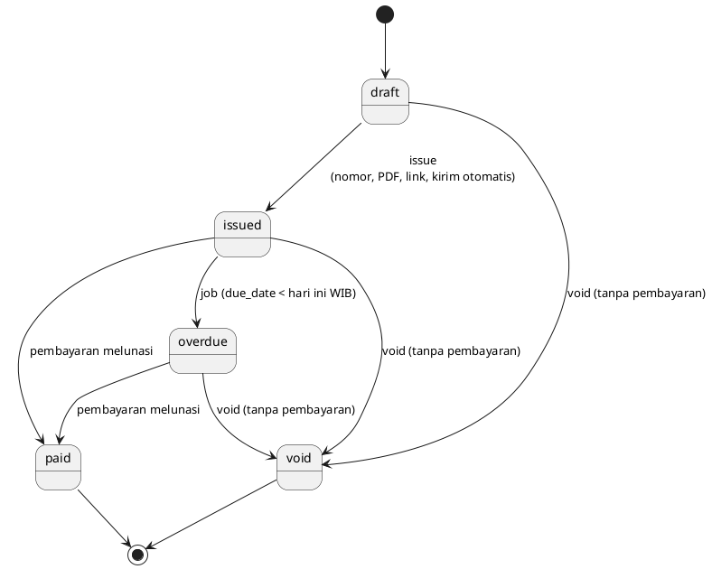
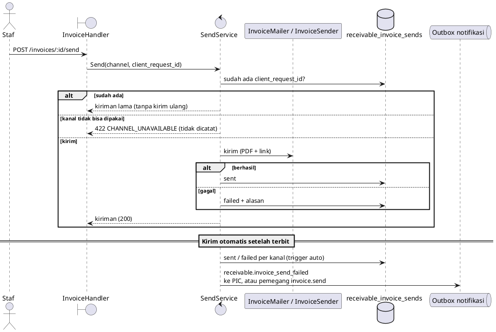

# Reference — Penagihan Tenant (`receivable`)

## Tujuan

Tenant (dengan **atau tanpa** CRM) membuat *billing account* dan invoice untuk pelanggannya sendiri,
menerbitkannya (nomor, PDF, link publik), mengirimnya lewat Email/WhatsApp dengan log dan **Retry**,
mencatat pembayaran manual, dan melihat invoice yang lewat jatuh tempo menjadi `overdue`.
Modul ini adalah fondasi Sales Order (S4) dan billing run (S5); checkout online ditambah S6.

Rilis 3 · S3. Spec: `docs/superpowers/specs/2026-10-05-sales-order-receivable-design.md`;
plan: `docs/superpowers/plans/2026-10-05-r3-s3-receivable.md`.

## Batas dengan modul lain

| | `receivable` | `billing` (platform) | `crm` |
|---|---|---|---|
| Siapa menagih siapa | Tenant → pelanggan tenant | Zyad → tenant (langganan SaaS) | — |
| Tabel | `receivable_*` (RLS) | `billing_*` (tanpa RLS) | `crm_*` |
| Route | `/api/v1/app/receivable/*` | `/api/v1/app/billing/*`, `/platform/billing/*` | `/api/v1/app/crm/*` |

- `receivable` **tidak mengimpor `crm`**. CRM boleh memanggil service receivable (S4).
- Invoice CRM lama (`crm_invoices`) dihapus; tabelnya di-drop oleh migration `000145`.
- Kanal kirim bukan dependensi langsung: `mailbox` (`InvoiceMailer`) dan `whatsapp` (`InvoiceSender`)
  memenuhi antarmuka `EmailSender`/`WhatsAppSender` milik receivable; perakitannya di `internal/app/receivable.go`.
- Kalkulator harga (`shared/pricing`) dan renderer PDF (`shared/docpdf`) dipakai bersama quotation dan invoice.

## Tabel (migration `000144`)

`receivable_settings`, `receivable_document_counters`, `receivable_accounts`, `receivable_invoices`,
`receivable_invoice_items`, `receivable_invoice_sends`, `receivable_payments`.

Semua memakai `organization_id NOT NULL`, FK komposit `(organization_id, id)`, `apply_organization_rls`,
dan **setiap query repository juga memfilter `organization_id` secara eksplisit**. Uang `numeric(18,2)`
(dibaca `::text`, dihitung `math/big`).

Indeks yang menjaga invariant:

| Indeks | Menjaga |
|---|---|
| `(organization_id, invoice_number) WHERE NOT NULL` | Nomor unik per organisasi (NULL selama draft) |
| `(organization_id, source_type, source_id, idempotency_key)` | Satu invoice per sumber+kunci (idempotensi S4/S5) |
| `(organization_id, contract_item_id, period_start)` | Satu tagihan per baris kontrak per periode |
| `(organization_id, invoice_id, client_request_id)` pada `…_sends` | Kirim ulang dengan id sama tidak tercatat dua kali |
| `(method, reference) WHERE reference IS NOT NULL AND method <> 'manual'` | Webhook provider yang sama tidak dicatat dua kali. **Referensi manual sengaja tidak unik** (catatan bebas, mis. nomor transfer; unik global akan bocor/bentrok antar tenant) |

Feature & entitlement: `receivable.enabled` (starter ke atas; organisasi platform bypass),
`receivable.online_payment` (semua paket false; hanya organisasi platform lewat bypass, dipakai S6).

Permission: `invoice.read|create|update|send|mark_paid` dipakai ulang (modul permission pindah ke `receivable`),
baru `invoice.void` dan `receivable.settings`.

## Status & transisi



- Pembayaran sebagian tidak mengubah status. Pembayaran yang melebihi sisa ditolak `PAYMENT_EXCEEDS_BALANCE`;
  dua pembayaran bersamaan diserialkan dengan `SELECT … FOR UPDATE` pada baris invoice.
- `Issue` kondisional `WHERE status = 'draft'`: dua klik / retry jaringan menghasilkan satu nomor, satu snapshot PDF,
  satu kiriman otomatis; pemenang yang mengirim, yang kalah mengembalikan invoice yang sama.
- Nomor `INV-YYYY-NNNN` per tahun per organisasi (tahun = tahun kalender **WIB** saat terbit). Celah nomor akibat
  balapan diterima.
- `due_date = issue_date + payment_terms_days`, tidak pernah sebelum `period_start` (prabayar). Semua tanggal
  dihitung di Asia/Jakarta (`businesstime.DayOf`).

## Pengiriman (Email/WhatsApp)



- Pengirim: manual = PIC → pengguna yang menekan tombol → pengirim default; otomatis/worker = PIC → pengirim default.
  Tanpa pengirim → kiriman `failed` "Belum ada pengirim. Atur PIC atau pengirim default di Pengaturan Penagihan."
  Invoice tetap `issued`; **Retry** = kirim manual lagi (boleh pilih kanal lain).
- WhatsApp hanya untuk account yang terhubung ke kontak CRM (`source_type = 'crm_contact'`); selain itu
  "WhatsApp hanya tersedia untuk pelanggan yang terhubung ke kontak CRM." Percakapan dibuka dengan `CanReadAll`
  karena pengirimnya pengguna penagihan, bukan pemilik percakapan CRM.
- Status yang boleh dikirim: `issued`, `overdue`, `paid` (bukti lunas). Lainnya `INVOICE_NOT_SENDABLE` (409).
- Pesan memuat PDF snapshot dan link publik `/i/<token>`; teks "Lihat & bayar" bila organisasi punya
  `receivable.online_payment`, selain itu "Lihat invoice". Semua nilai di HTML di-escape.
- Detail galat provider tidak pernah ditampilkan ke pengguna (hanya log server).
- Event notifikasi `receivable.invoice_send_failed` harus terdaftar di `NotificationRuleService` **dan**
  `VariableRegistry`; event tanpa rule di-*ignore* diam-diam oleh consumer.

## Halaman publik

`GET /api/v1/public/invoices/:token` (+ `/pdf`), tanpa login, rate limit 30/menit per IP (`rl:pubi:ip:`),
`X-Robots-Tag: noindex`, `Cache-Control: no-store`. Tenant diturunkan dari baris link lewat
`WorkerResolver` identitas `public-document-link` (sama dengan penawaran). Link berlaku sampai jatuh tempo + 90 hari
(23:59:59 WIB); token tidak dikenal/kedaluwarsa/bukan invoice → `404 LINK_INVALID` yang sama.
`state`: `open` (issued/overdue), `paid`, `void` — invoice void tetap tampil "Dibatalkan" walau linknya dicabut.
`can_pay` hanya untuk `open` + `receivable.online_payment`.

### Pembayaran online DOKU (S6)

Hanya org **platform** (bypass `SubscriptionGuardService` untuk `receivable.online_payment`); tenant lain tidak melihat tombol Bayar.

- `POST /public/invoices/:token/checkout` → `{payment_url, expires_at}`. Jumlah = **sisa** tagihan, pecahan dibulatkan ke atas ke rupiah.
  Nomor DOKU `RCV-<uuid invoice>`. Sesi `pending` yang belum kedaluwarsa (60 menit) dipakai ulang → URL sama.
  Galat: `403 ONLINE_PAYMENT_UNAVAILABLE` (tanpa sesi DOKU dibuat), `409 INVOICE_NOT_PAYABLE`, `502 PAYMENT_CHECKOUT_FAILED`.
- `GET /public/invoices/:token/status` → `{status}`; menjalankan `CheckStatus` DOKU bila ada sesi pending (maks 1×/10 detik per invoice, in-memory).
- Callback DOKU → `/i/<token>?paid=1`.
- Sesi disimpan di `receivable_checkouts` (directory tanpa RLS, migration `000149`) supaya webhook menemukan organisasi dari nomor DOKU.

### Webhook

Satu route `POST /api/v1/webhooks/doku`. Setelah verifikasi signature, nomor ber-prefix `RCV-` diteruskan ke
`ReceivableDokuProcessor` (adapter di `internal/app`; `billing` tidak mengimpor `receivable`), sedangkan nomor lain tetap diproses `billing`.

| Kondisi | Hasil |
|---|---|
| Nomor `RCV-` tak dikenal | 200 (DOKU berhenti retry), log warn |
| Status bukan sukses | 200, tidak ada pembayaran, sesi tetap `pending` |
| Sukses | `RecordProvider` method `doku`, reference = `transaction.original_request_id` (atau nomor+tanggal); idempoten; jumlah dibatasi sisa |
| Invoice sudah void/lunas atau melebihi sisa | 200 + log error "perlu refund manual"; **tidak** ada pembayaran tercatat |
| Galat tak terduga | 500 agar DOKU mengirim ulang |

## Listener (modul lain)

```go
registry.Add(listener) // Listener.InvoicePaid / ContractCreated
```

Dipanggil **setelah commit**; panic listener ditelan dan dicatat, jadi pembayaran yang sudah sah tidak gagal karena
efek samping. S4 mendaftar untuk `ContractCreated`; `InvoicePaid` membawa `SourceType/SourceID/ContractID`.

`ContractEnded` (Rilis 4 S3) dipicu **tepat sekali** per contract, saat statusnya berubah menjadi `ended`: `ContractService.End` dan
billing run (`EndExpired` mengembalikan contract yang baru diakhiri). Billing run di `cmd/worker` perlu listener CRM terdaftar agar
akses workspace ikut dicabut. `SetEndDate` tidak memicu event karena status belum berubah.

## Job overdue

`cmd/worker`: tiap jam `OverdueRunner.RunOnce` — per organisasi aktif (halaman 100), resolve scope dengan identitas
`receivable-overdue`, `MarkOverdue(hari bisnis WIB)`. Galat satu organisasi dicatat lalu lanjut. `-once` menjalankan
satu putaran.

## Endpoint

Lihat `api/openapi.yaml` (tag `Receivable`). Ringkas, di bawah `/api/v1/app/receivable`:
`accounts` (CRUD sebagian), `invoices` (list/create/get/update draft, `issue`, `void`, `pdf`, `link`, `send`,
`sends`, `payments`), `payments`, `settings`, `members/senders`. Galat: `INVOICE_NOT_DRAFT|NOT_SENDABLE|NOT_PAYABLE|HAS_PAYMENTS`
409, `PAYMENT_EXCEEDS_BALANCE|CHANNEL_UNAVAILABLE|VALIDATION_ERROR` 422, `INVOICE_NOT_FOUND|ACCOUNT_NOT_FOUND` 404,
`INVOICE_PDF_FAILED` 502. Id di path/body divalidasi sebagai UUID di handler; PIC dan pengirim default divalidasi
sebagai anggota aktif organisasi.

## Contract & penagihan order (Rilis 3 S4)

`OrderBilling` (`BillOrder`, `BillDelivery`) dipakai CRM; semua langkah idempoten per `(SourceType, SourceID)` sehingga aman diulang
setelah gagal di tengah. Urutan `BillOrder`: **account** (dari kontak CRM, diperbarui bila berubah) → **contract** (baris berulang;
unik per sumber, nomor `CTR-YYYY-NNNN`, `ContractCreated` hanya saat dibuat) → **invoice awal** (baris prabayar, key `initial`,
menautkan `contract_item_id` periode pertama).

- **Periode:** `pricing.AddPeriod(start, freq, n)` dihitung dari `start_date` dengan clamp akhir bulan (31 Jan bulanan → 28/29 Feb → 31 Mar);
  `PeriodRange(n) = [AddPeriod(n), AddPeriod(n+1) − 1 hari]`.
- **Contract item:** prabayar mulai `period_index=1` (periode 1 sudah ditagih di invoice awal), pascabayar `period_index=0`;
  `next_period_start/end` dipakai billing run (S5). Deskripsi baris periode: `"<deskripsi> (periode 5 Okt 2026 – 4 Nov 2026)"`.
- **BillDelivery:** satu invoice per `batchKey` (`delivery:<batchKey>`) untuk baris sekali bayar pascabayar.
- **Endpoint** (`/app/receivable/contracts`): `GET` list/detail, `PATCH /:id` (tanggal akhir ≥ hari ini WIB atau null), `POST /:id/end`
  (alasan 1–500). Permission `contract.read|manage`. Galat `CONTRACT_NOT_FOUND` 404, `CONTRACT_NOT_ACTIVE` 409.
- Migration `000146`: tabel `receivable_contracts`/`receivable_contract_items`, FK `receivable_invoices.contract_id` dan
  `receivable_invoice_items.contract_item_id`.
- **Fitur item contract (Rilis 4 S3, migration `000152`):** `receivable_contract_items.features` (jsonb array `[{feature_key,value,label}]`)
  menyimpan snapshot fitur produk dari `OrderLine.Features`; receivable tidak menafsirkannya (dibaca CRM untuk entitlement workspace).

## Billing run & Recurring Billing (Rilis 3 S5)

Worker (`cmd/worker`, job `receivable-billing-run`, **tiap 1 jam**; `-once` = satu putaran) menerbitkan dan mengirim invoice periode
berikutnya untuk setiap contract aktif, per organisasi (`BillingRunner` → `BillingRun.Run`).

- **Tanggal tagih** (hari ini = tanggal WIB): prabayar = `next_period_start − invoice_lead_days`; pascabayar = `next_period_end + 1 hari`.
  Item jatuh tempo bila tanggal tagih ≤ hari ini **dan** (`end_date` kosong atau `next_period_start ≤ end_date`).
- **Satu invoice per (contract, tanggal tagih)**: `source_type=contract`, `source_id=contract_id`, `idempotency_key=period:<YYYY-MM-DD>`;
  baris membawa `contract_item_id` + periode, deskripsi `"<deskripsi> (periode 1 Nov 2026 – 30 Nov 2026)"`.
- **Idempoten & aman paralel:** setelah terbit, item dimajukan kondisional (`WHERE period_index = <lama>`). Bila proses berhenti di antara
  terbit dan maju, putaran berikut mendapat invoice yang sama dan tetap memajukan item. Kiriman otomatis **tidak** diulang untuk invoice yang
  sudah ada, jadi kiriman gagal tidak memicu notifikasi tiap jam.
- **Catch-up:** contract tertinggal ditagih satu invoice per periode, berurutan; maks 24 putaran per contract per run, 500 item per query.
- Contract dengan `end_date < hari ini` tanpa item jatuh tempo tersisa → `ended`, alasan "Masa kontrak berakhir".
- Migration `000148`: indeks query jatuh tempo.
- **Endpoint:** `GET /app/receivable/overview` (`contract.read`): kontrak aktif, nilai berulang per frekuensi, tagihan 30 hari ke depan,
  invoice belum lunas, kiriman gagal belum terselesaikan. `GET /contracts/:id` menambah `upcoming` (3 tanggal tagih berikutnya per item).
- Catatan worker: tidak memiliki Redis, jadi pengiriman WhatsApp dari billing run berjalan tanpa rate limiter. Bila storage tenant belum
  dikonfigurasi (PDF snapshot butuh asset store) job dinonaktifkan dengan peringatan log, seperti mail sync.

## Catatan operasional

- Route katalog (`/app/catalog`) dan mailbox (`/app/mailboxes`, `/app/emails`) terbuka untuk `crm.enabled` **atau**
  `receivable.enabled` agar tenant non-CRM bisa memilih produk dan menghubungkan email.
- Sebelum menjalankan `000145` di produksi: `SELECT count(*) FROM crm_invoices;` — bila > 0, ekspor dulu.
- Belum ada: pembayaran online (S6), pengingat jatuh tempo.
