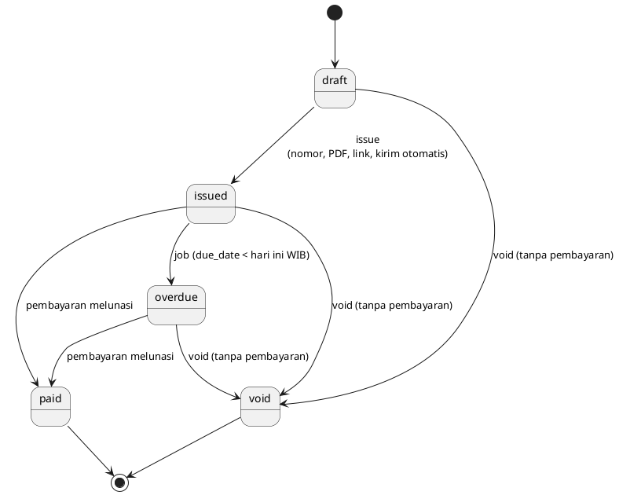
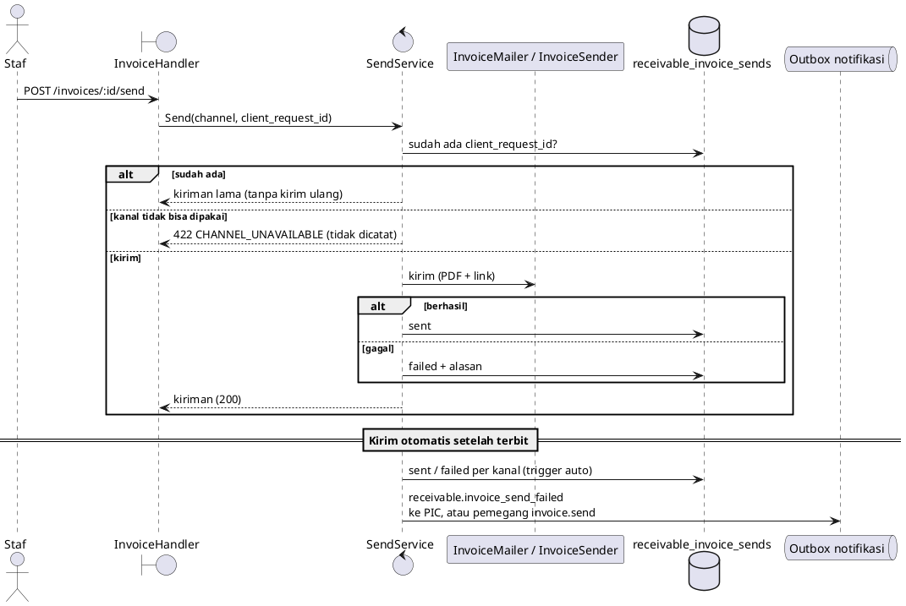

# Reference — Penagihan Tenant (`receivable`)

## Tujuan

Tenant (dengan **atau tanpa** CRM) membuat *billing account* dan invoice untuk pelanggannya sendiri,
menerbitkannya (nomor, PDF, link publik), mengirimnya lewat Email/WhatsApp dengan log dan **Retry**,
mencatat pembayaran manual, dan melihat invoice yang lewat jatuh tempo menjadi `overdue`.
Modul ini adalah fondasi Sales Order (S4) dan billing run (S5); checkout online ditambah S6.

Rilis 3 · S3. Spec: `docs/superpowers/specs/2026-10-05-sales-order-receivable-design.md`;
plan: `docs/superpowers/plans/2026-10-05-r3-s3-receivable.md`.

## Batas dengan modul lain

| | `receivable` | `billing` (platform) | `crm` |
|---|---|---|---|
| Siapa menagih siapa | Tenant → pelanggan tenant | Zyad → tenant (langganan SaaS) | — |
| Tabel | `receivable_*` (RLS) | `billing_*` (tanpa RLS) | `crm_*` |
| Route | `/api/v1/app/receivable/*` | `/api/v1/app/billing/*`, `/platform/billing/*` | `/api/v1/app/crm/*` |

- `receivable` **tidak mengimpor `crm`**. CRM boleh memanggil service receivable (S4).
- Invoice CRM lama (`crm_invoices`) dihapus; tabelnya di-drop oleh migration `000145`.
- Kanal kirim bukan dependensi langsung: `mailbox` (`InvoiceMailer`) dan `whatsapp` (`InvoiceSender`)
  memenuhi antarmuka `EmailSender`/`WhatsAppSender` milik receivable; perakitannya di `internal/app/receivable.go`.
- Kalkulator harga (`shared/pricing`) dan renderer PDF (`shared/docpdf`) dipakai bersama quotation dan invoice.

## Tabel (migration `000144`)

`receivable_settings`, `receivable_document_counters`, `receivable_accounts`, `receivable_invoices`,
`receivable_invoice_items`, `receivable_invoice_sends`, `receivable_payments`.

Semua memakai `organization_id NOT NULL`, FK komposit `(organization_id, id)`, `apply_organization_rls`,
dan **setiap query repository juga memfilter `organization_id` secara eksplisit**. Uang `numeric(18,2)`
(dibaca `::text`, dihitung `math/big`).

Indeks yang menjaga invariant:

| Indeks | Menjaga |
|---|---|
| `(organization_id, invoice_number) WHERE NOT NULL` | Nomor unik per organisasi (NULL selama draft) |
| `(organization_id, source_type, source_id, idempotency_key)` | Satu invoice per sumber+kunci (idempotensi S4/S5) |
| `(organization_id, contract_item_id, period_start)` | Satu tagihan per baris kontrak per periode |
| `(organization_id, invoice_id, client_request_id)` pada `…_sends` | Kirim ulang dengan id sama tidak tercatat dua kali |
| `(method, reference) WHERE reference IS NOT NULL AND method <> 'manual'` | Webhook provider yang sama tidak dicatat dua kali. **Referensi manual sengaja tidak unik** (catatan bebas, mis. nomor transfer; unik global akan bocor/bentrok antar tenant) |

Feature & entitlement: `receivable.enabled` (starter ke atas; organisasi platform bypass),
`receivable.online_payment` (semua paket false; hanya organisasi platform lewat bypass, dipakai S6).

Permission: `invoice.read|create|update|send|mark_paid` dipakai ulang (modul permission pindah ke `receivable`),
baru `invoice.void` dan `receivable.settings`.

## Status & transisi



- Pembayaran sebagian tidak mengubah status. Pembayaran yang melebihi sisa ditolak `PAYMENT_EXCEEDS_BALANCE`;
  dua pembayaran bersamaan diserialkan dengan `SELECT … FOR UPDATE` pada baris invoice.
- `Issue` kondisional `WHERE status = 'draft'`: dua klik / retry jaringan menghasilkan satu nomor, satu snapshot PDF,
  satu kiriman otomatis; pemenang yang mengirim, yang kalah mengembalikan invoice yang sama.
- Nomor `INV-YYYY-NNNN` per tahun per organisasi (tahun = tahun kalender **WIB** saat terbit). Celah nomor akibat
  balapan diterima.
- `due_date = issue_date + payment_terms_days`, tidak pernah sebelum `period_start` (prabayar). Semua tanggal
  dihitung di Asia/Jakarta (`businesstime.DayOf`).

## Pengiriman (Email/WhatsApp)



- Pengirim: manual = PIC → pengguna yang menekan tombol → pengirim default; otomatis/worker = PIC → pengirim default.
  Tanpa pengirim → kiriman `failed` "Belum ada pengirim. Atur PIC atau pengirim default di Pengaturan Penagihan."
  Invoice tetap `issued`; **Retry** = kirim manual lagi (boleh pilih kanal lain).
- WhatsApp hanya untuk account yang terhubung ke kontak CRM (`source_type = 'crm_contact'`); selain itu
  "WhatsApp hanya tersedia untuk pelanggan yang terhubung ke kontak CRM." Percakapan dibuka dengan `CanReadAll`
  karena pengirimnya pengguna penagihan, bukan pemilik percakapan CRM.
- Status yang boleh dikirim: `issued`, `overdue`, `paid` (bukti lunas). Lainnya `INVOICE_NOT_SENDABLE` (409).
- Pesan memuat PDF snapshot dan link publik `/i/<token>`; teks "Lihat & bayar" bila organisasi punya
  `receivable.online_payment`, selain itu "Lihat invoice". Semua nilai di HTML di-escape.
- Detail galat provider tidak pernah ditampilkan ke pengguna (hanya log server).
- Event notifikasi `receivable.invoice_send_failed` harus terdaftar di `NotificationRuleService` **dan**
  `VariableRegistry`; event tanpa rule di-*ignore* diam-diam oleh consumer.

## Halaman publik

`GET /api/v1/public/invoices/:token` (+ `/pdf`), tanpa login, rate limit 30/menit per IP (`rl:pubi:ip:`),
`X-Robots-Tag: noindex`, `Cache-Control: no-store`. Tenant diturunkan dari baris link lewat
`WorkerResolver` identitas `public-document-link` (sama dengan penawaran). Link berlaku sampai jatuh tempo + 90 hari
(23:59:59 WIB); token tidak dikenal/kedaluwarsa/bukan invoice → `404 LINK_INVALID` yang sama.
`state`: `open` (issued/overdue), `paid`, `void` — invoice void tetap tampil "Dibatalkan" walau linknya dicabut.
`can_pay` hanya untuk `open` + `receivable.online_payment` (checkout menyusul di S6).

## Listener (modul lain)

```go
registry.Add(listener) // Listener.InvoicePaid / ContractCreated
```

Dipanggil **setelah commit**; panic listener ditelan dan dicatat, jadi pembayaran yang sudah sah tidak gagal karena
efek samping. S4 mendaftar untuk `ContractCreated`; `InvoicePaid` membawa `SourceType/SourceID/ContractID`.

## Job overdue

`cmd/worker`: tiap jam `OverdueRunner.RunOnce` — per organisasi aktif (halaman 100), resolve scope dengan identitas
`receivable-overdue`, `MarkOverdue(hari bisnis WIB)`. Galat satu organisasi dicatat lalu lanjut. `-once` menjalankan
satu putaran.

## Endpoint

Lihat `api/openapi.yaml` (tag `Receivable`). Ringkas, di bawah `/api/v1/app/receivable`:
`accounts` (CRUD sebagian), `invoices` (list/create/get/update draft, `issue`, `void`, `pdf`, `link`, `send`,
`sends`, `payments`), `payments`, `settings`, `members/senders`. Galat: `INVOICE_NOT_DRAFT|NOT_SENDABLE|NOT_PAYABLE|HAS_PAYMENTS`
409, `PAYMENT_EXCEEDS_BALANCE|CHANNEL_UNAVAILABLE|VALIDATION_ERROR` 422, `INVOICE_NOT_FOUND|ACCOUNT_NOT_FOUND` 404,
`INVOICE_PDF_FAILED` 502. Id di path/body divalidasi sebagai UUID di handler; PIC dan pengirim default divalidasi
sebagai anggota aktif organisasi.

## Catatan operasional

- Route katalog (`/app/catalog`) dan mailbox (`/app/mailboxes`, `/app/emails`) terbuka untuk `crm.enabled` **atau**
  `receivable.enabled` agar tenant non-CRM bisa memilih produk dan menghubungkan email.
- Sebelum menjalankan `000145` di produksi: `SELECT count(*) FROM crm_invoices;` — bila > 0, ekspor dulu.
- Belum ada: pembayaran online (S6), kontrak & billing run (S4/S5), pengingat jatuh tempo.
